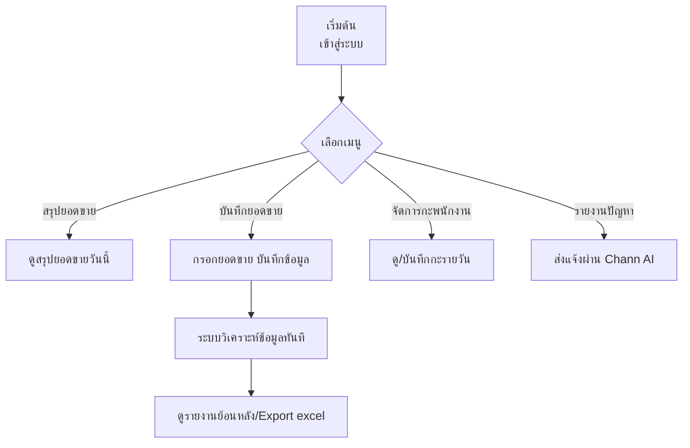

# Chann AI Platform - คู่มือผู้ใช้งาน

## 🛠️ คุณสมบัติหลัก

- ระบบบริหารจัดการยอดขาย กะพนักงาน และการลา
- อัปเดตเป้ายอดขายประจำวัน และรายงานผลได้ทันที
- วิเคราะห์ข้อมูลร้านครบวงจร: ยอดขาย กะ แรงงาน OT รายงานสรุป ฯลฯ
- เครื่องมือยืม-คืนอุปกรณ์ระหว่างสาขา
- ผู้ช่วย AI อัตโนมัติ จัดการข้อมูลแทนมนุษย์

---

## 🚀 วิธีเริ่มต้นใช้งาน

1. **ล็อกอินเข้าสู่ระบบ** ด้วยสิทธิ์ที่ได้รับ (Admin, Manager, หรือพนักงาน)
2. เลือกเมนูที่ต้องการ เช่น สรุปยอด กะ/แรงงาน หรือจัดการฐานข้อมูล
3. ใช้ฟังก์ชัน “บันทึกยอดขาย”, “บันทึกชั่วโมงแรงงาน” หรือ “สลับกะ” ได้จากหน้าหลัก

---

## 🔄 ตัวอย่าง Flowchart วิธีการใช้งานหลัก



---

## 🔑 สิทธิ์การใช้งาน

| สิทธิ์     | คำอธิบายการเข้าถึง                             |
|------------|------------------------------------------------|
| Admin      | Full Access ทุกเมนู/ตั้งค่า/เครื่องมือโค้ด     |
| Manager    | Access เมนูบริหารพนักงานและยอดขาย              |
| Staff      | ดูตารางกะ แจ้งลา สลับกะของตัวเอง               |

---

## 💡 คำสั่งเด่น (ใช้กับ Chann AI)

- "บันทึกยอดขายวันนี้ X"     → Save Daily Sale
- "ตั้งแรงงาน OT วันที่ X"    → Save OT
- "เอาไฟล์ excel ยอดขาย"     → Export sales report
- "สรุปภาพรวมร้านวันนี้"     → Get cross-system summary

---

## 📁 โครงสร้างโปรเจคโดยย่อ

```
client/src/        # Frontend (React)
server/            # Backend (Node.js/Express)
shared/            # Shared models & utils
public/            # Static files
```

---

## 📝 ติดต่อ/ขอความช่วยเหลือ

- ถาม Chann AI ได้ตลอดเวลา (ทางกล่องข้อความหน้าแอป)
- Admin ติดต่อทีม Dev ผ่านทางระบบ Agent Request
